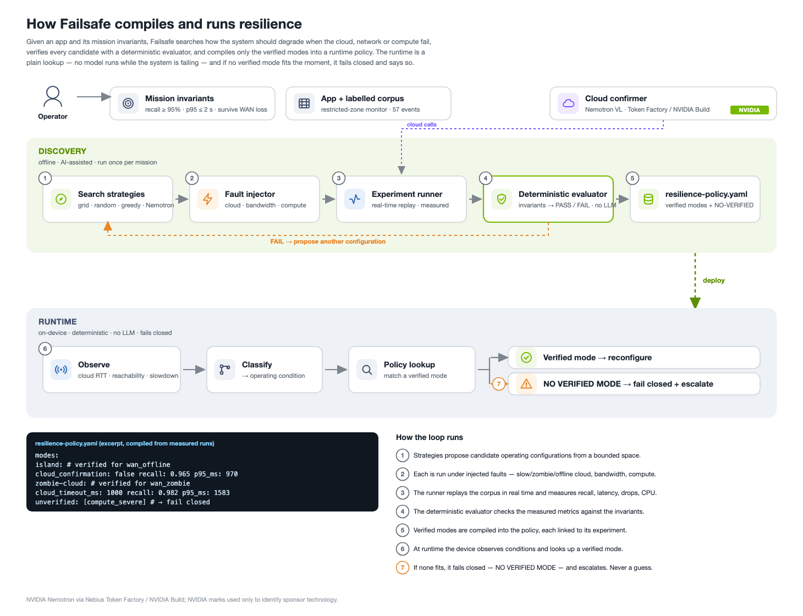
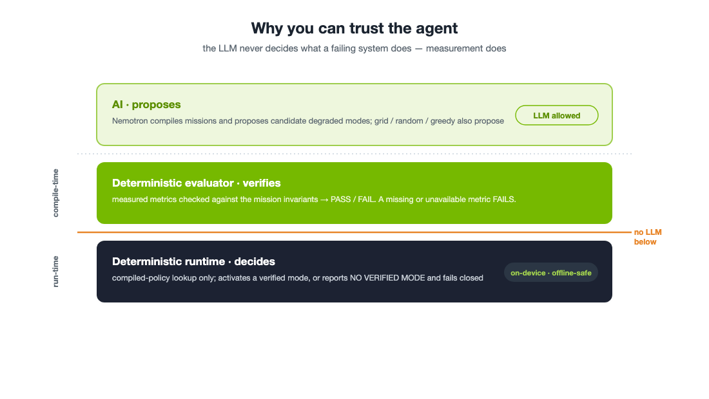
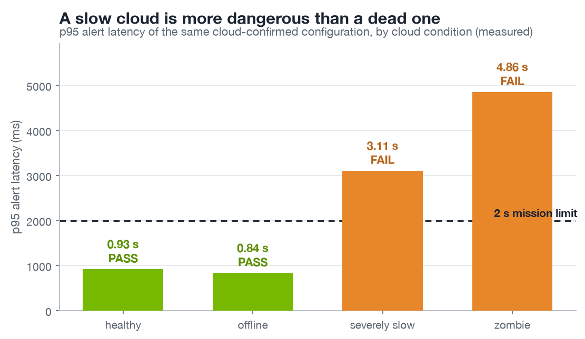
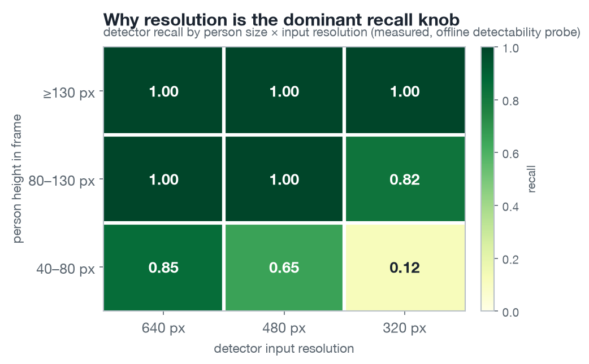
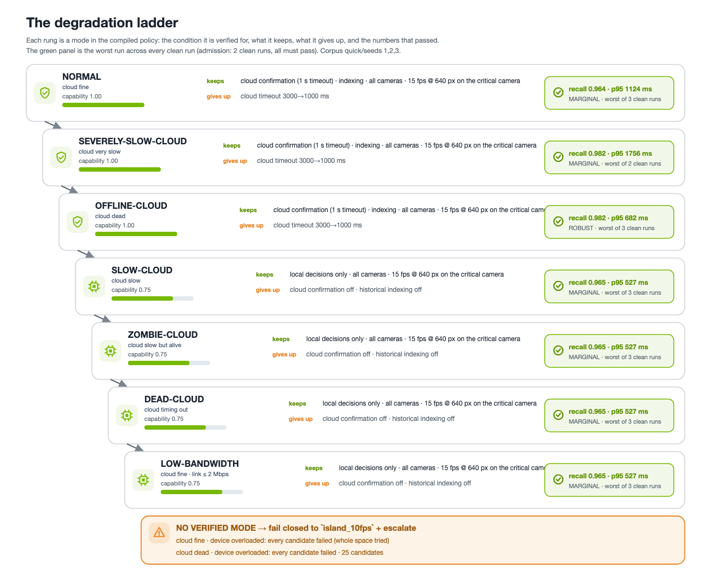
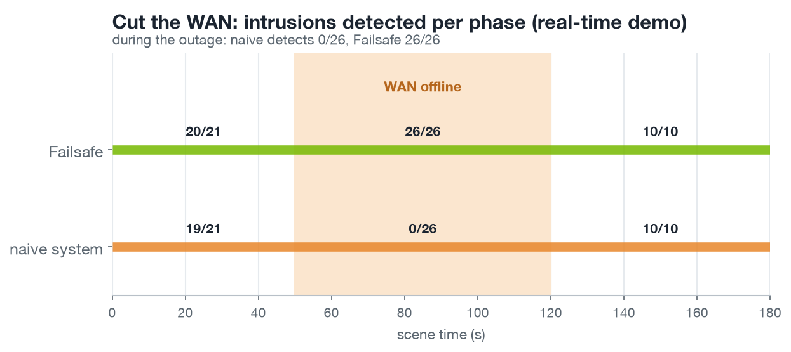
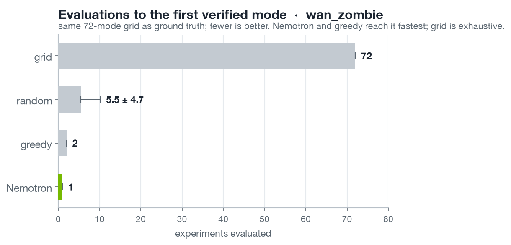
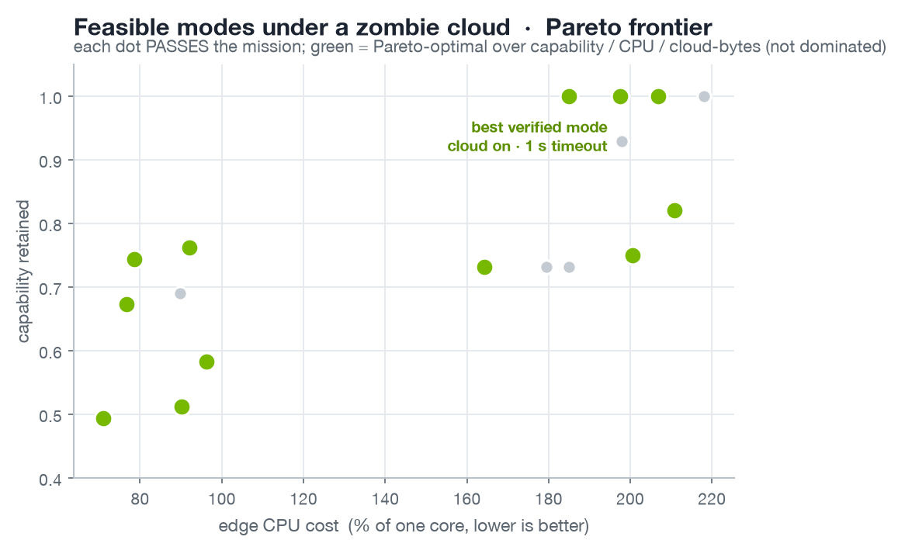
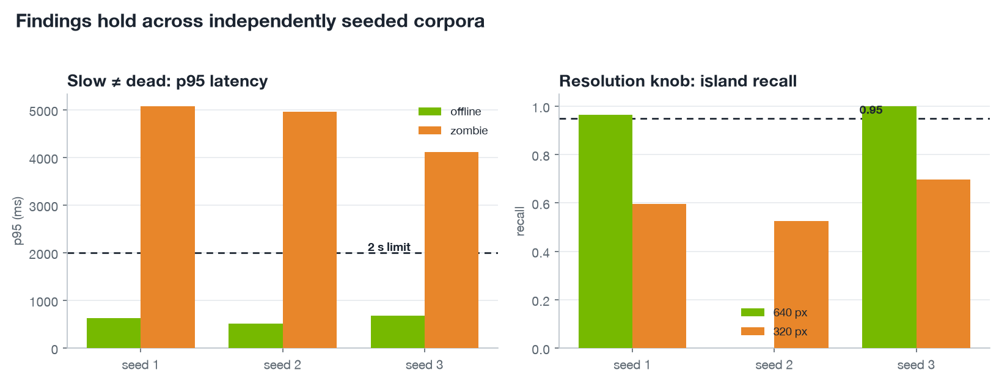
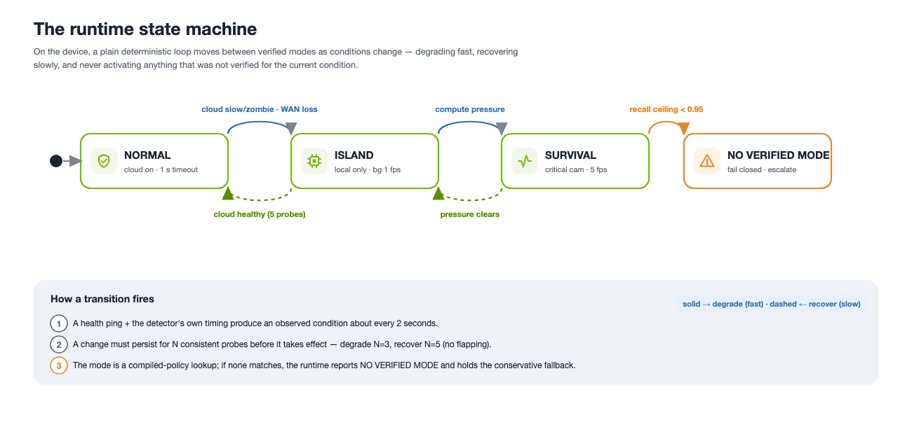

# Failsafe: a resilience compiler for edge / physical-AI systems

**Research report.** All numbers here are MEASURED on the evaluation corpus and reproducible from
`artifacts/`; none are illustrative. Figures are generated by `docs/diagrams/` from the same result
files. "Verified" throughout means *passed the deterministic evaluator on the stated corpus*, not a
claim of universal or certified safety.

---

## Abstract

Edge and physical-AI systems increasingly pair a small on-device model with cloud reasoning, and
they work well until the real world stops behaving like a data center: the WAN drops, the cloud
turns slow, bandwidth collapses, or the accelerator saturates. Today engineers hand-write fallback
logic for these cases and hope it still meets the requirement. **Failsafe** instead *experimentally
discovers* the cheapest capability degradation that preserves a stated mission under injected
failures, *verifies* each candidate with a deterministic evaluator, and *compiles* only the verified
modes into a runtime policy that is looked up deterministically, no model runs while the system is
failing. On a restricted-zone monitoring workload we measured 200+ real-time experiments across two
72-configuration grids and found, among other results, that **a reachable-but-slow cloud is more
dangerous than an offline one** (p95 alert latency 5.05 s vs 0.84 s for the same configuration), that
the fix is a discoverable threshold (a 1 s cloud timeout brings it to 1.77 ± 0.19 s; two of three
runs pass, so the verified zombie mode is the cloud-off `island` configuration, §3.2), and that under
severe compute pressure **no configuration in the space passes**, which Failsafe reports as
`NO VERIFIED MODE` rather than shipping a guess. An LLM (NVIDIA Nemotron) proposes candidates and, in
the one live search that completed, reached the best verified mode in fewer evaluations than
uninformed search; it is scored against the same measured grid and cannot make a failing
configuration pass.



---

## 1. Problem

A physical-AI application, cameras watching a hazardous zone, a robot, a drone, typically depends
on a stack of resources: a local detector, cloud confirmation/reasoning, a network link, a compute
budget, sensors. Each of these degrades independently in deployment. The failure that matters is not
"the model is slightly less accurate" but "the system silently stopped doing the one thing it
promised", e.g. missing a person entering a dangerous area because every alert was waiting on a
cloud that had gone slow.

The state of practice is hand-written graceful degradation ("if the cloud times out, use the local
model"). Two problems: (1) it is **unverified**, nobody measured whether the fallback still meets the
requirement under that failure; (2) it handles the cases an engineer imagined, not the ones that
occur. Recent industry guidance (Google's 2026 agentic-edge note; AWS offline-first edge guidance)
argues systems *should* degrade gracefully, but leaves the engineering to the developer.

**Failsafe's thesis:** turn hand-guessed fallbacks into measured, verified, automatically compiled
degradation. Discover what works *before* deployment; deploy only what was proven; fail closed when
nothing fits.

---

## 2. Approach

The loop is: `mission + application → propose degraded configurations → inject failures →
measure → verify against invariants → compile verified modes → deterministic runtime`.

Two separations define the design and are the reason the system is trustworthy:

1. **Discovery (offline, AI-assisted) vs. runtime (online, deterministic).** An LLM reasons about
   candidates *before* deployment; at runtime a compiled policy is a table lookup. No LLM is on the
   path that decides what a failing system does.
2. **Proposal vs. verification.** Anything, grid search, a greedy heuristic, Nemotron, may
   *propose* a configuration. Only the deterministic evaluator, checking measured metrics against
   the `MissionSpec`, may *accept* one.



### 2.1 Mission specification

A mission states **invariants** (hard: `critical_event_recall ≥ 0.95`, `alert_latency_p95_ms ≤
2000`, survive WAN loss), **objectives** (soft, for ranking passing configs: maximise precision,
minimise cloud bytes and CPU), and **degradable capabilities**. Candidates are ordered
lexicographically, *feasible → capability retained → quality → cost*, never by a scalar weighted
score, so "graceful degradation" means literally "sacrifice as little as possible while staying
feasible."

### 2.2 Workload, corpus, and metrics

The evaluation workload is a restricted-zone monitor: four cameras, a real YOLOv8n person detector at
a configurable input resolution, foot-point-in-polygon zone logic, optional cloud confirmation of a
detection, and an alert. The discovery corpus is a **seeded synthetic scene generator** that
composites real person cutouts onto procedurally drawn facility backgrounds; ground truth (a person's
foot inside the zone) is analytic, so recall and precision are exact. The corpus is calibrated
(documented in `docs/DECISIONS.md` D-016) so that resolution, FPS, and occlusion *materially* affect
outcomes, otherwise there is nothing to discover.

Experiments replay the corpus in **wall-clock real time**; latency is only reported when
`time_scale == 1.0` and is UNAVAILABLE otherwise (a simulated clock is used only in unit tests).
Every result records seed, config/scenario/mission hashes, git SHA, versions, backend, and its raw
alerts, so any result can be re-scored under a changed rule without re-running, and any experiment
can be reproduced.

### 2.3 Fault model

Cloud state is modelled with `slow ≠ dead` as an explicit design choice: `healthy` (≈50 ms) ·
`slow` (≈500 ms) · `severely_slow` (≈1.5 s) · `zombie` (accepted, answers after 5-10 s) · `timeout`
(never answers) · `offline` (fails immediately). Bandwidth is a token bucket on the cloud path;
compute pressure is realised by competing CPU processes, and its *observed* impact on detector
timing is recorded rather than assumed.

---

## 3. Findings

Corpus: synthetic `quick` seed 1, 57 ground-truth events, YOLOv8n on CPU, YOLOv8m stand-in confirmer
in a child process, real-time replay. Full matrix in `artifacts/phase1_report.md`; the headline
results:

### 3.1 A slow cloud is more dangerous than a dead one

The single most non-obvious result. For the *same* cloud-confirmed configuration, an **offline**
cloud is handled by the fail-over path immediately (p95 0.84 s, PASS), a **zombie** cloud makes the
pipeline wait out its timeout on every candidate (p95 **5.05 s**, FAIL), and a ~1.5 s-RTT cloud is in
between (p95 2.95 s, FAIL). A system that fails fast is safe; a system that is merely slow is not.



### 3.2 The fix is a discoverable threshold

Shortening the cloud timeout from 3 s to 1 s brings the zombie-cloud p95 from 5.05 s down to
1.77 ± 0.19 s over three runs, and two of the three pass. The third (2.03 s) exceeds the 2 s
invariant, so under the admission rule, every clean run must pass (D-037), this configuration is
**not** verified under a zombie cloud; the compiled zombie mode is the cloud-off `island`
configuration (four clean runs, all passing). The threshold is real and discoverable, and the same
1 s configuration is verified under `healthy` and `wan_offline`. What the repeats add is the
honest part: at 1 s the zombie case sits inside the latency noise floor, which is exactly the kind of
threshold a hand-written fallback cannot know and a runtime probe must respect (D-008).

### 3.3 Resolution is the dominant recall knob; FPS is often free

Detector input resolution drives recall (640→480→320 px: 0.965 → 0.737 → 0.596 under `healthy`),
because small/distant people are only found at 640 px. Critical-camera FPS 15→5, by contrast, costs
nothing on this corpus. So the *cheap* degradation is FPS, not resolution, a fact a hand-written
fallback is unlikely to get right.



### 3.4 More sensing can make the system worse

Demanding 30 fps at 640 px on an edge budget that sustains ≈21-23 fps drops 1,672 frames and lowers
recall (0.912) while raising latency, a counter-intuitive backpressure effect that a naive "more
FPS = safer" heuristic gets backwards. Failsafe's search treats overload as a first-class signal
(D-027).

### 3.5 When nothing works, say so

Under severe compute pressure, **no configuration in the 72-mode space passes** (best achievable
recall 0.807 < 0.95). Failsafe reports this as `NO VERIFIED MODE` with the measured ceiling and
fails closed to a conservative fallback, rather than promoting a least-bad configuration. This is the
property that makes the verifier worth having.

### 3.6 The degradation ladder

The verified modes form a capability ladder, each rung a real measured mode with what it sacrifices
and the numbers that passed.



### 3.7 End-to-end: cut the WAN

In a real-time run of the full timeline (healthy → WAN cut at 50 s → restored at 120 s), a naive
static system missed **all 26** intrusions during the outage (overall recall 0.509, FAIL), while
Failsafe switched to the verified `offline-cloud` mode **3 s** after the cut and caught **26 of 26**
during the outage (overall recall 0.982, p95 782 ms, PASS). The runtime recovered to `normal` after
the hysteresis window when the WAN returned. Both tracks ran on the same footage under a simulated
clock; the mode transitions and per-phase recall are in `artifacts/demo/`.



*(A caveat carried honestly: precision showed no measurable cost for local-only mode on this
geometric corpus, a null result, D-022. The intended semantic precision cost, authorised vs
unauthorised persons that only the cloud VLM can distinguish, is future work.)*

---

## 4. Search strategies: can reasoning reach the frontier faster?

Over a bounded space of 72 configurations (critical/background FPS × resolution × cloud timeout ×
indexing), each measured exhaustively per scenario, we compare four strategies by **replay against
the same measured grid** (D-026): grid (exhaustive), random (neutral baseline), a greedy
bottleneck heuristic, and Nemotron-guided. The benchmark is never rigged to favour the LLM, results
are reported as measured, including where the LLM does not win.

**`wan_zombie` (bottleneck = one knob, the cloud timeout):**

| strategy | evaluations to first verified mode | capability of what it found |
|---|---|---|
| grid | 72 (exhaustive) | 1.00 |
| random | 5.5 ± 4.7 (analytic (N+1)/(k+1) = 5.6) | 0.73 (mean) |
| greedy | 2 | 1.00 |
| **Nemotron** | **1** | **1.00** |



Nemotron proposed the optimal mode in its first candidate, reconstructing the "slow ≠ dead → short
timeout" insight from the evidence in the prompt. It beat the greedy heuristic here (1 vs 2) by going
straight to the 1 s timeout instead of stepping down from 3 s.

**`compute_severe` (the honesty test):** Nemotron proposed 15 candidates over 6 rounds, none passed,
and it terminated with `NO VERIFIED MODE`, matching the exhaustive grid's ground truth. It reasoned
correctly about capacity but did not hallucinate a passing configuration; the schema guard rails and
the deterministic evaluator held.

**Reliability caveat (measured, and the point of the trust boundary).** The LLM is not uniformly
reliable: across the real Nemotron runs, two of four produced no usable proposal at all, one emitted
two consecutive schema-invalid outputs and one exhausted its round budget without a valid candidate.
This is reported, not hidden (non-negotiable #6). Crucially, it changes *nothing* downstream: an
invalid proposal is rejected before evaluation and never reaches the policy, so a failed Nemotron run
degrades to "this strategy found no verified mode," never to a bad deployed configuration. The model's
unreliability is absorbed by the same propose/verify boundary that keeps it out of the runtime, which
is exactly why the boundary exists.

The Pareto view under a zombie cloud (feasible configurations, non-dominated over capability / CPU /
cloud bytes):



**Honest reading.** This is the easy regime for reasoning: the bottleneck is one knob and the prompt
supplies the measured capacity facts, so the model is reasoning over given evidence, not
rediscovering physics. The interesting open question is whether the advantage grows as failure
conditions become *compositional* (multiple simultaneous faults), where a domain heuristic has to
enumerate interactions but a reasoner might not. This is the natural next experiment.

---

## 5. Generalization across seeds

To check the findings are not a seed-1 artifact, the experiments behind each headline result were
re-measured on two independently generated corpora (seeds 2 and 3). They hold:

| finding (metric) | seed 1 · seed 2 · seed 3 | expected |
|---|---|---|
| Slow ≠ dead, **offline** p95 (ms) | 635 · 520 · 682 | ≤ 2000 → PASS |
| Slow ≠ dead, **zombie** p95 (ms) | 5077 · 4958 · 4117 | > 2000 → FAIL |
| Timeout fix, normal @1 s, zombie p95 (ms) | 1765 · 1662 · 1639 | ≤ 2000 → PASS |
| Resolution, island recall @640 px | 0.965 · n/a · 1.000 | ≥ 0.95 |
| Resolution, island recall @320 px | 0.596 · 0.526 · 0.696 | < 0.95 |
| No-verified, island recall (compute) | 0.708 · 0.684 · 0.679 | < 0.95 |



The core claims replicate cleanly on all three corpora: an offline cloud is fast (0.5-0.7 s) while a
zombie cloud blows the 2 s limit (4.1-5.1 s); the 1 s-timeout fix passes every seed (1.6-1.8 s);
under compute pressure island recall is ~0.68-0.71 on every seed, well under 0.95, so `NO VERIFIED
MODE` is not seed-specific. The one blank cell (island @640, seed 2) is an experiment the
contention QC (D-028) excluded because concurrent CPU work corrupted its timing; the resolution
effect is nonetheless shown by @640 passing on seeds 1 and 3 and @320 failing on all three. This is
generalization across the synthetic generator; the real-video holdout (§7) is a separate, stronger
check on independently sourced footage.

---

## 6. Runtime

The compiled policy is executed by a deterministic runtime that classifies the observed condition
(cloud reachability, p95 RTT from lightweight health pings, detector slowdown), looks up a verified
mode, applies hysteresis (degrade after 3 consistent probes, recover after 5), and fails closed when
no verified mode matches. No LLM is on this path.

"Verified" has a stated bar (D-037): a mode is admitted only when the configuration has at least
two un-contended runs under that condition, pooled across corpus seeds and repeats, and every one of
them passes the invariants; its reported recall and p95 are the worst observed, not the best. The
policy records this rule in itself. Conditions with no verified mode carry a reason, *untested*,
*insufficient evidence*, *marginal*, or *refuted* (with an *exhaustive* flag when the whole search
space was tried), and the runtime's `NO VERIFIED MODE` message repeats it, so "we never tested this"
and "we tried 73 configurations and none passed" are not the same message. The fallback is the most
conservative admitted configuration (no cloud wait first, then least demand), not the baseline.

### 6.1 Where it is verified, and where it isn't

Every condition the compiler looked at, one per row. Green rows passed on every clean run; the
others say why there is no verified mode, so nothing is guessed. The table is generated from the
compiled policy (`scripts/policy_table.py`), not written by hand.

<!-- policy-coverage:start -->
| Condition | Verdict | What the experiments showed |
|---|---|---|
| **Cloud fine** (`healthy`) | verified, marginal | `normal`: catches 96/100, alerts within 1.1 s. Worst of 3 clean runs, across corpus seeds 1, 2, 3. |
| **Cloud slow (about half a second)** (`wan_slow`) | verified, marginal | `slow-cloud`: catches 96/100, alerts within 0.5 s. Worst of 3 clean runs, across corpus seeds 1, 2, 3. |
| **Cloud very slow (about 1.5 s)** (`wan_severely_slow`) | verified, marginal | `severely-slow-cloud`: catches 98/100, alerts within 1.8 s. Worst of 2 clean runs, across corpus seeds 2, 3. |
| **Cloud slow but alive (5 to 10 s)** (`wan_zombie`) | verified, marginal | `zombie-cloud`: catches 96/100, alerts within 0.5 s. Worst of 3 clean runs, across corpus seeds 1, 2, 3. |
| **Cloud timing out** (`wan_timeout`) | verified, marginal | `dead-cloud`: catches 96/100, alerts within 0.5 s. Worst of 3 clean runs, across corpus seeds 1, 2, 3. |
| **Cloud dead** (`wan_offline`) | verified, robust | `offline-cloud`: catches 98/100, alerts within 0.7 s. Worst of 3 clean runs, across corpus seeds 1, 2, 3. |
| **Link down to 2 Mbps** (`bandwidth_2mbps`) | verified, marginal | `low-bandwidth`: catches 96/100, alerts within 0.5 s. Worst of 3 clean runs, across corpus seeds 1, 2, 3. |
| **Device overloaded** (`compute_severe`) | no verified mode | Every candidate tried failed at least one clean run. The whole 72-configuration space was tried. |
| **Cloud dead and device overloaded** (`offline_compute_severe`) | no verified mode | Every candidate tried failed at least one clean run. 25 candidates tried. |

Admission bar: 2 clean runs across 2 corpus seeds, every one passing. Corpus quick/seeds 1,2,3. Fallback when nothing is verified: `island_10fps`. Compiled 2026-09-07T09:16:38 UTC.
<!-- policy-coverage:end -->



An interactive operator console (`ui/console.html`) drives this runtime with the real measured
numbers: inject a condition and watch the mode switch, or turn Failsafe off to see the naive system
miss intrusions during an outage.

---

## 7. Real-video holdout (independently sourced footage)

The discovery corpus is synthetic by design (labelled, controllable, seeded). The single most
important external check is whether the workload's real component, the person detector and the
restricted-zone rule that every mission invariant is measured through, behaves on footage the search
never touched. We run it against **NVIDIA's PhysicalAI-SmartSpaces** dataset
(`MTMC_Tracking_2025 / val / Warehouse_015`, CC-BY 4.0): a warehouse CCTV camera with per-frame
ground-truth person boxes, generated in Omniverse and never used by any experiment or search.

A 45 s segment (60-105 s) was replayed at 6 FPS, 270 frames, through the **actual** pipeline
(YOLOv8n @640 on CPU, the same detector as the campaigns) under a scripted fault timeline
(healthy → WAN offline → restored → compute pressure), scoring detections against the dataset's own
person boxes at IoU ≥ 0.4.

| metric | value | basis |
|---|---|---|
| person-detection recall | **0.72** | 5,370 GT person boxes |
| person-detection precision | **0.971** | matched alerts / all detections |
| zone-occupancy agreement | **269 / 270 frames** | detector vs GT foot-point-in-zone |

Two honest caveats. (1) This is a **dense** scene, ~20 people per frame, ~15 detected, so the
central zone is essentially always occupied; there is only **one** discrete zone *entry* event in the
window, which makes "intrusion latency" statistically thin here. The defensible real-video claim is
therefore **per-frame zone-occupancy agreement** (269/270), not an entry-latency figure. (2) The
72 % recall is a small CPU detector on a crowded 1080p frame with heavy mutual occlusion; it is the
honest floor of the cheapest edge configuration, and it is exactly why the mission invariant is
`critical_event_recall ≥ 0.95` measured over *events* (2 s grace) rather than per frame, an event is
caught if any of its frames fires. The holdout confirms the detector and zone logic transfer to
independently generated footage; it is not a claim of certified detection. Raw frames, per-frame
boxes and the trace are published with the release page (§6 console / demo).

---

## 8. Generalizing beyond CCTV

Restricted-zone monitoring is the *first* workload, not the system. Failsafe is a compiler, and its
loop is domain-independent: the fault injectors (WAN loss, zombie/slow cloud, bandwidth collapse,
compute pressure), the experiment engine, the deterministic evaluator, the search strategies, the
policy compiler, and the fail-closed runtime are all written against abstract metrics and configs , 
they never mention people, boxes or zones. What is domain-specific is a small, isolated **front-end**:

- **the workload pipeline**, the real perception/control stack under test;
- **the mission invariants**, the hard requirements it must preserve;
- **the degradable knobs**, what the runtime is allowed to trade away;
- **a ground-truth source**, to score candidates against.

Adding a domain is writing a front-end plus supplying data, not rebuilding the system. One finding
recurs across all of them and is worth stating plainly: **slow ≠ dead is universal.** A laggy cloud
planner mid-grasp, a laggy telemetry link on a drone, a late perception frame in a car, an
intermittent satellite downlink, each is the same failure mode the CCTV workload surfaced, and each
is invisible to a naive "is the cloud up?" check.

| Domain | The failure that matters | Example invariant | Degradation ladder | Candidate real dataset | Status |
|---|---|---|---|---|---|
| **CCTV / smart spaces** | zombie cloud; compute pressure | zone-event recall ≥ 0.95; alert p95 ≤ 2 s | full → island (local-only) → NO VERIFIED MODE | NVIDIA PhysicalAI-SmartSpaces | **Validated (§7)** |
| **Self-driving (dashcam)** | perception outputs *late* under compute overload; remote-assist link drops | detect VRUs in the ego path within a latency bound | slow down → widen gap → drop L2 features → minimal-risk stop | KITTI seq 0016 (real); NVIDIA Cosmos deferred | **Validated (§8.1)** |
| **Drones (UAV)** | comms/RF link laggy-not-dead; GPS loss | detect VRUs in a ground zone; maintain geofence | reduce speed → tighten geofence → onboard-only nav → return-to-home | VisDrone MOT (real) | **Validated (§8.2)** |
| **Robots (proximity safety)** | cloud planner slows mid-motion; comms lost | detect a human in the safety envelope; slow / stop | slow → reduced task set → local reflex → safe-stop | JRDB via HF (real) | **Validated (§8.3)** |
| **Satellites (onboard EO)** | scarce/intermittent downlink; radiation compute throttle | flag all target events before the downlink window; stay in power/thermal budget | high-confidence tiles only → lower res → onboard filter → defer | ESA Φ-sat cloud-detection / RaVAEn | Future work |

Two honest qualifications. (1) Each future-work front-end still needs its own workload, ground truth
and (where no dataset injects faults) a simulator, the *framework* generalizes, a validated *result*
in each domain does not come for free. (2) The datasets carry a mix of licenses (NVIDIA PhysicalAI /
Cosmos CC-BY 4.0; KITTI CC-BY-NC-SA; VisDrone non-commercial); results here are scoped to a research
prototype with attribution, not a claim of commercial deployment.

### 8.1 Self-driving holdout (KITTI)

The self-driving front-end reuses the shared compiler unchanged, only the workload, zone and
invariant differ: a dashcam replaces the warehouse camera, an ego-path trapezoid replaces the
restricted zone, and VRU (pedestrian + cyclist) recall replaces person recall. Run over **KITTI
tracking sequence 0016**, a dense urban crossing, **209 real dashcam frames, 2,299 ground-truth VRU
boxes**, under the same fault timeline (healthy → compute pressure → link offline → restored),
YOLOv8n @640 on CPU measures:

| metric | value | basis |
|---|---|---|
| VRU-detection recall | **0.617** | 2,299 GT boxes, IoU ≥ 0.4 |
| VRU-detection precision | **0.864** | matched detections / all detections |
| ego-path occupancy agreement | **174 / 176 frames** (0.989) | detector vs GT foot-point-in-path |

As in the CCTV holdout the scene is continuously occupied (one discrete entry event), so the honest
claim is per-frame ego-path agreement, not entry latency. Recall is lower than the warehouse
(0.617 vs 0.72) for expected reasons: VRUs here are smaller and faster, and cyclists' ground-truth
boxes include the bicycle while the detector fires on the person, depressing IoU. The result stands
as a **second real holdout on independently sourced footage**, produced with no change to the
discover → verify → compile → fail-closed machinery. The NVIDIA Cosmos-Drive-Dreams run (the larger,
on-brand equivalent, with 4D tracking + calibration for projected 2D ground truth) is deferred to a
Nebius job: the synthetic set ships as a single ~700 GB split archive with no per-clip download, so it
is impractical to replay locally.

### 8.2 Drone holdout (VisDrone)

A third front-end, aerial this time: a downward drone camera watches a ground zone, the critical event
is a VRU inside it, and the failure that matters is a laggy or lost comms link. Run over **VisDrone
MOT sequence `uav0000137_00458_v`**, a busy intersection shot from a UAV, **233 real aerial frames,
9,299 ground-truth VRU boxes**, under the healthy → compute → comms-offline → restored timeline.
Because aerial objects are small, detection runs at 1280 input (versus 640 for the ground cameras);
web frames are still written at 960.

| metric | value | basis |
|---|---|---|
| VRU-detection recall | **0.746** | 9,299 GT boxes, YOLOv8n @1280, IoU ≥ 0.3 |
| VRU-detection precision | **0.672** | matched detections / all detections |
| ground-zone occupancy agreement | **233 / 233 frames** (1.000) | detector vs GT foot-point-in-zone |

The trade-off inverts from the ground domains: raising detection resolution recovers recall on small
aerial targets (0.746, the highest of the three holdouts), but the dense scene at a low confidence
floor costs precision (0.672, the detector fires on ambiguous small blobs). Precision is a soft
objective in the mission, so this is exactly the kind of measured cost the compiler ranks rather than
hides. The intersection is never empty, so, as in the other two domains, the defensible claim is
per-frame zone-occupancy agreement (perfect here), not entry latency. Same compiler, a third real
holdout.

### 8.3 Robot holdout (JRDB)

The robot domain is framed as **human-robot proximity safety** (speed-and-separation monitoring): the
robot's own camera must flag a person entering its safety envelope and keep doing so when the cloud
planner / remote-assist link is lost, the same person-detection + zone + fault-timeline shape, with a
tighter latency invariant (400 ms) because a moving robot has little separation budget. The data is
**JRDB** (Stanford JackRabbot, a social-navigation robot's cameras among people), via the Hugging Face
mirror `vladyslava-rudas/jrdb-proxemic-risk`, real robot-camera frames with the **closest** person's
2D box and a human-labeled proxemic `danger_level`. Run over sequence
`clark-center-intersection-2019-02-28_0` (58 real frames):

| metric | value | basis |
|---|---|---|
| closest-person recall | **0.879** | the nearest (collision-critical) person, IoU ≥ 0.4 |
| recall on high/moderate-danger frames | **0.857** | frames the dataset labels as elevated risk |
| safety-zone occupancy agreement | **33 / 35 frames** (0.943) | detector vs GT closest-person-in-envelope |

The honest caveat that shapes the metrics: this dataset labels only the **closest** person per frame,
not every person, so we report closest-person detection and safety-zone agreement rather than the
full multi-person recall/precision triple of the other three domains. That is actually the
safety-relevant quantity (the nearest human is the collision risk), and cross-checking against the
human `danger_level` label, 0.857 recall on the elevated-risk frames, is an independent signal the
other holdouts don't have. For the full multi-person recall/precision triple, `scripts/robot_holdout.py`
is code-complete and unit-tested against the gated full-GT JRDB download (`labels_2d` JSON or the
KITTI-style rows the toolkit emits; `tests/test_robot_holdout.py`), awaiting a registered download , 
the same "ready, awaiting gated data" status as the NVIDIA Cosmos AV run (§8.1).

### 8.4 Robot manipulation / object detection (YCB-Video): the fail-closed guarantee, on real data

The other four holdouts all detect *people*. To show the compiler is detector- and task-agnostic, the
fifth is **object** detection: a manipulation robot's camera must recognise the graspable objects on
the table, and keep doing so when the cloud VLM/planner drops. Run over **YCB-Video sequence 0011**
(111 real tabletop frames) with the same generic YOLOv8n (COCO classes):

| metric | value | basis |
|---|---|---|
| object-detection recall | **0.273** | class-aware, COCO-known objects, IoU ≥ 0.4 |
| object-detection precision | **0.989** | when it names a known object it is almost always right |
| workspace occupancy agreement | **0.712** | 74 / 104 object-in-workspace frames |

This is the most instructive holdout precisely because the cheap config **fails**, and the compiler
catches it. The per-class decomposition: of the six objects on the table, **three are outside the
generic detector's vocabulary entirely** (power drill, two clamps → 0 by construction); of the three
it could know, only the **bowl detects reliably (0.77)**, while the bleach cleanser mapped to "bottle"
(0.05) and the mug to "cup" (0.01) mostly do not. Aggregate recall 0.273 is far below the 0.95 mission
floor, so on this workload Failsafe compiles **`NO VERIFIED MODE`** for the cheap generic detector
rather than shipping a robot that cannot see its own tools, the fail-closed guarantee (non-negotiable
#3) demonstrated on real footage. Precision 0.989 shows the honest flip side: what the edge model does
recognise, it is right about. The discoverable fix is a capability upgrade (a fine-tuned detector),
exactly the kind of trade-off the compiler is built to surface. **Five domains, five real holdouts,
one unchanged compiler, four where a verified mode exists, one where the compiler correctly refuses.**

---

## 9. Limitations & threats to validity

- **Corpus is synthetic and single-tier.** The discovery corpus is a calibrated evaluation
  instrument, not a claim about the world; the real-video holdout (§7) is the external check.
  Discovery and validation evidence are kept strictly separated (D-004).
- **Single hardware, single detector.** All local; an Apple M3 on CPU. GPU metrics are UNAVAILABLE
  locally and would be MEASURED on Nebius. The edge-capacity landscape (and therefore the overload
  findings) is hardware-specific; every result records its measured detector baseline so
  cross-platform comparison is explicit.
- **The confirmer is a heavier local model, not a VLM.** Its rejections are geometric, not semantic,
  which is why precision showed no landscape (D-022). Nemotron VL via Token Factory is the intended
  Phase-4 confirmer.
- **Measurement hygiene.** Contended runs (other CPU work on the same laptop) are detected
  (`qc_suspect_contention`, D-028) and de-prioritised; verdicts within one event / 250 ms of a
  threshold are labelled *marginal* rather than treated as robust (D-029).
- **Not a certified safety system.** "Verified" is scoped to the evaluation corpus and the defined
  experiments.

---

## 10. Reproducibility

```bash
uv sync --extra dev
uv run pytest                                             # 101 tests, ~3 s (simulated clock)
uv run failsafe calibrate                                 # once per host, on an idle machine (D-041)
uv run failsafe corpus stats --tier quick                # corpus statistics
uv run failsafe run --config island --scenario wan_offline   # one real-time experiment
uv run failsafe sweep --configs all --scenarios wan_zombie   # a grid (skips cached)
uv run failsafe compare --scenario wan_zombie            # grid/random/greedy/Nemotron
uv run failsafe compile-policy                           # verified results → policy
uv run failsafe campaign --configs all --scenario wan_zombie --executor nebius --dry-run  # Nebius Serverless Jobs (parallel campaign)
uv run failsafe demo --timeline "healthy:0,wan_offline:50,healthy:120"   # cut-WAN demo
uv run failsafe search --scenario wan_zombie --strategy llm --provider nemotron   # needs a key
uv run python scripts/real_holdout.py run                 # real-video holdout (§7) + release trace
uv run python scripts/av_holdout.py run                   # self-driving holdout (§8.1) on KITTI seq 0016
uv run python scripts/fetch_visdrone.py                   # fetch one VisDrone sequence (HF mirror)
uv run python scripts/drone_holdout.py run                # drone holdout (§8.2) on VisDrone MOT
uv run python scripts/robot_holdout_hf.py run             # robot holdout (§8.3) on JRDB via HF
uv run python scripts/robot_holdout.py selftest          # full-GT robot front-end (gated JRDB), unit-tested
uv run python scripts/ycb_holdout.py fetch && uv run python scripts/ycb_holdout.py run  # object-detection holdout (§8.4)
```

Every experiment carries full provenance and its raw alerts; `failsafe rescore` re-derives metrics
under the current scoring rule without re-running. Figures regenerate from `docs/diagrams/`.

---

## 11. Related work

Adaptive edge/cloud inference (Sedna, AxiomVision, DACC/MacEdge) optimises the *current* operating
point for efficiency but keeps an adaptive policy in the live loop and does not verify degraded modes
against a mission. Chaos-engineering harnesses (and the Nebius-awarded Balagan) inject failures and
*report* robustness; Failsafe additionally *compiles* the measurements into a deployable verified
policy and a deterministic runtime. Model/inference optimisers (TensorRT-LLM AutoDeploy, NetsPresso)
make one model fast for target hardware, a different problem. To our knowledge, no existing system's
core workflow is *application + mission invariants → discover degradation → verify experimentally →
compile a fail-closed runtime policy.*

---

## 12. Resources, citation and acknowledgements

| | |
|---|---|
| Source code | [github.com/samadon1/failsafe](https://github.com/samadon1/failsafe) |
| Release page (live demo) | [samadon1.github.io/failsafe](https://samadon1.github.io/failsafe/) |
| Architecture | [`docs/ARCHITECTURE.md`](ARCHITECTURE.md) |
| Decision log | [`docs/DECISIONS.md`](DECISIONS.md) |
| Metric definitions and results | [`docs/EXPERIMENTS.md`](EXPERIMENTS.md) |
| Holdout dataset | [NVIDIA PhysicalAI-SmartSpaces](https://huggingface.co/datasets/nvidia/PhysicalAI-SmartSpaces) (CC-BY 4.0) |

Reproduce the whole loop from the command line:

```bash
uv sync --extra dev
uv run pytest
uv run failsafe calibrate
uv run failsafe compare --scenario wan_zombie
uv run failsafe compile-policy
uv run python scripts/real_holdout.py run
```

### Cite

```bibtex
@misc{failsafe2026,
  title        = {Failsafe: a resilience compiler for edge and Physical-AI systems},
  author       = {Donkor, Samuel},
  year         = {2026},
  note         = {Nebius x NVIDIA Global AI Hackathon, Physical-AI track},
  howpublished = {\url{https://github.com/samadon1/failsafe}}
}
```

### Sponsor technology, as actually used

**NVIDIA Nemotron** (`nemotron-3-super-120b-a12b`) proposes candidate configurations in the
search, served from NVIDIA Build; four live runs are recorded, of which one completed, two were
rejected by the evaluator before any experiment ran, and one correctly found nothing under compute
pressure. The **Nebius Serverless Jobs** executor is built and dry-run tested; no job has been
submitted yet (account activation pending). The LLM never sits in the runtime decision loop.

### Acknowledgements

Real-video validation and the live demo use the NVIDIA **PhysicalAI-SmartSpaces** dataset
(`MTMC_Tracking_2025`), generated in NVIDIA Omniverse and released under CC-BY 4.0, used with
attribution and never used by the search. The cross-domain holdouts use **KITTI** (self-driving),
**VisDrone** (drone), **JRDB** (robot safety) and **YCB-Video** (robot manipulation), each under its
own license and attributed in §8. The person detector is Ultralytics **YOLOv8**. Built for the
Nebius × NVIDIA Global AI Hackathon (Physical-AI track); NVIDIA marks are used only to identify
sponsor technology.

### Scope

Failsafe is a research prototype. "Verified" is scoped to the evaluation corpus and the defined
experiments; it is not a claim of certified safety, guaranteed hazard detection, or regulatory
compliance. Every metric is measured, simulated, derived or unavailable, and labelled as such.
